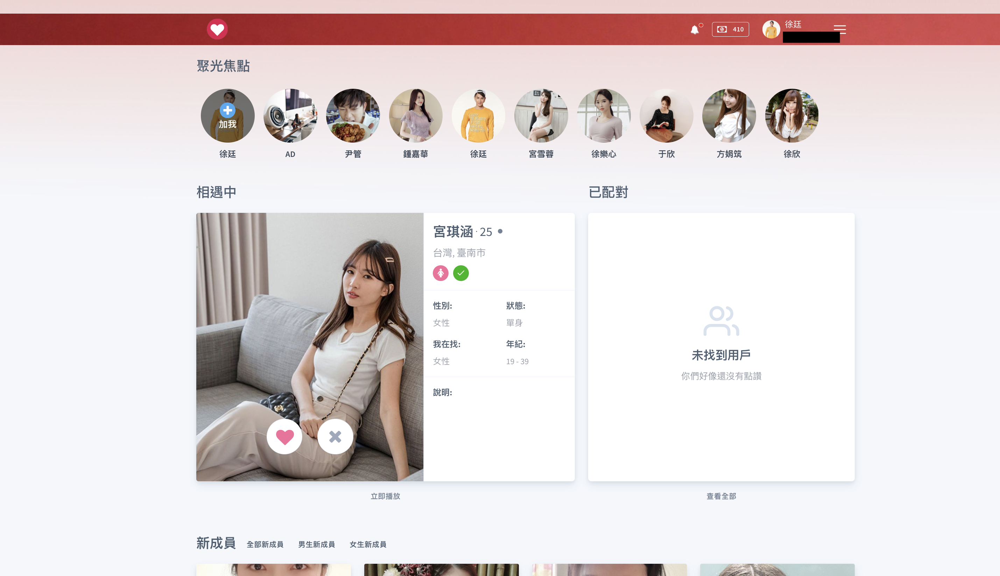
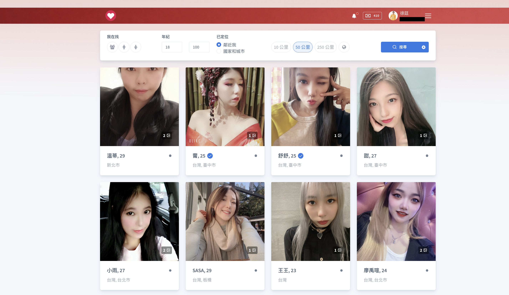
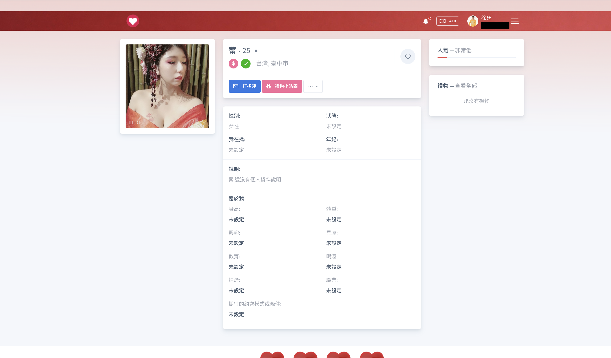
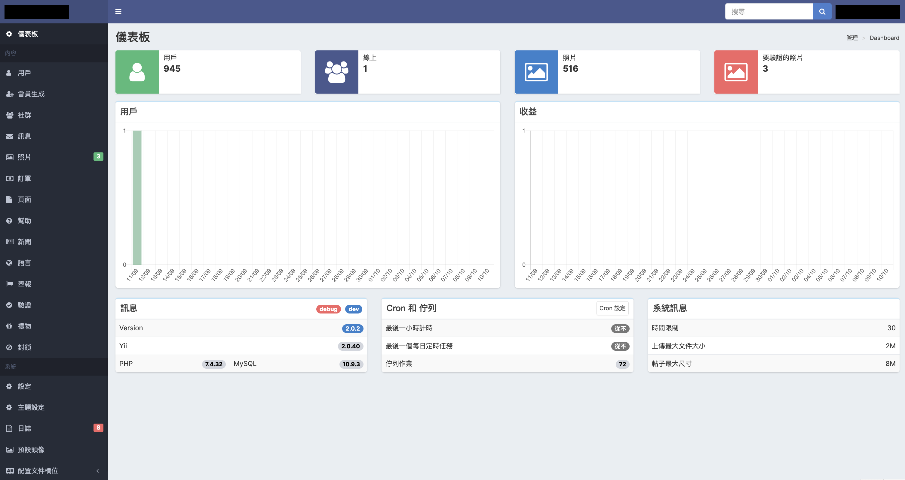
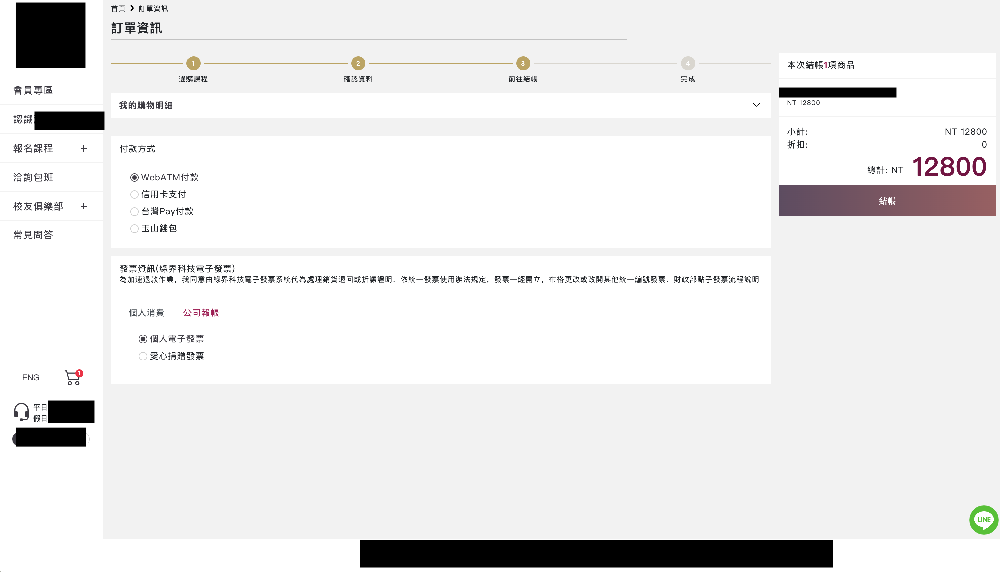
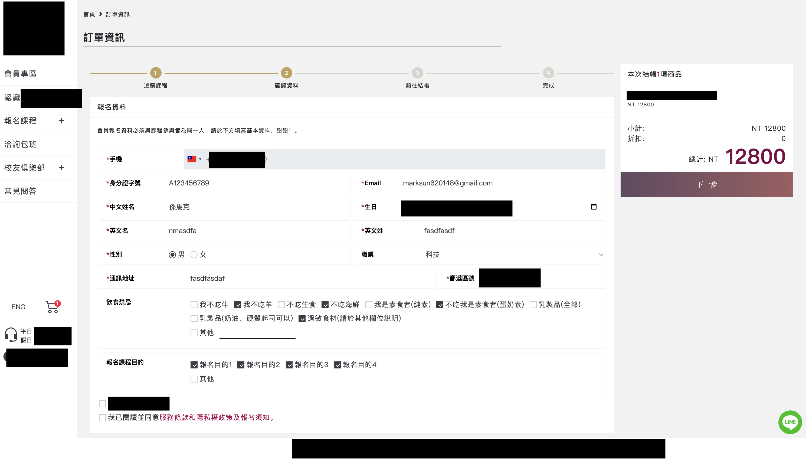
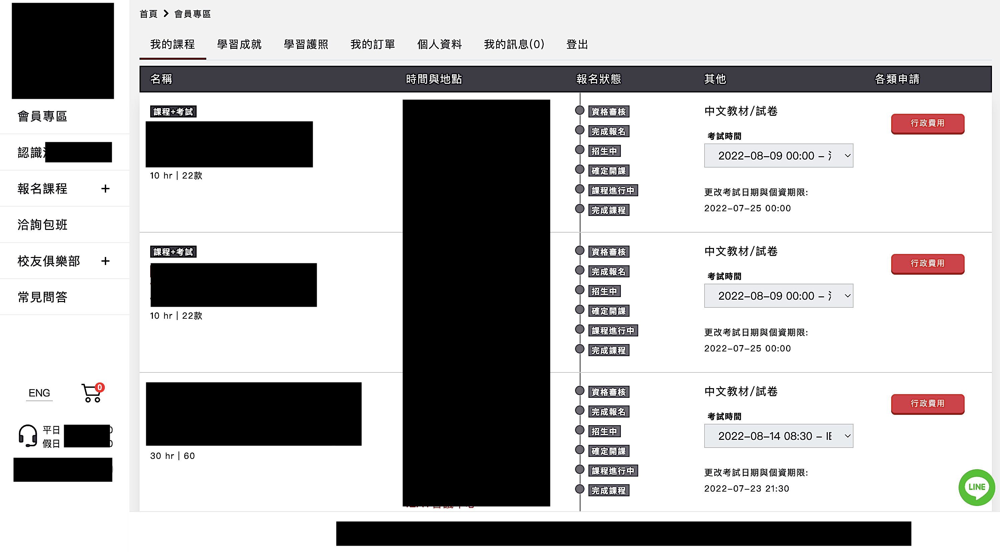
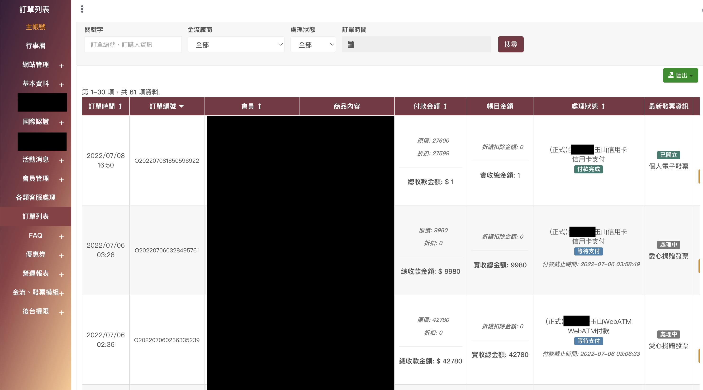

# Mark **Sun**



## 工作經歷

### **璿宇數位有限公司** `2021.03 - 2022.06`

_PHP軟體研發工程師_ 

- 後台管理系統功能維護/擴充 (Yii2)。
- VueJS 2 客戶端頁面套版。
- 使用 Workerman 開發即時聊天室。
- 依照市場需求製作對應報表。
- 利用 Telegram 監控 server 網路狀態、自動化上傳 Android & iOS app 至阿里雲 OSS 服務。
- 串接第三方遊戲、金流 Api。

### **育學雲端股份有限公司** `2020.06 - 2020.10`

_PHP & Wordpress 工程師_ 

- 使用 Laravel 開發公司內部行銷管理系統。
- 利用 Wordpress 架設公司行銷系統。

### **中央研究院 人文社會科學研究中心** `2018.06 - 2019.10`

_實習生_ 

- 使用 Laravel、jQuery 做 資料下載平台 (院內內部使用)。
- 導入Git 以及 Python ORM (SQLAlchemy)，以方便爬蟲維護以及資料處理。
- 利用R做簡單機器學習和資料清理與分析。
- 使用 php (PHP Simple HTML DOM Parser、HTTP_REQUEST2) 抓取各大醫院資料 (等代推床人數、等代推床人數、等待加護病床人數...etc)。
- 使用asyncio、scrapy 抓取含有Angular或是含有大量資料以及訪問次數限制網站之資料，並使用Flask製作進度平台觀察爬蟲進度。

---

## 作品

### **愛情網**

---
該服務使用 Nginx、PHP 7.4、MariaDB、Memcache、Yii 2.0 開發。 
服務內容包含，照片分享(用戶能選擇觀看者須贊助後才能觀看)、用戶推薦(女性用戶喜歡男性後才能發訊息)、觀看附近的人、即時聊天(ajax)、發送禮物、支付系統(藍星支付、Stripe、PayPal)、後台管理系統、檢舉封鎖系統、支援多語系。

---

---
### **某課程線上教學系統**

---
該服務使用 Nginx、PHP 7.4、MySQL、Memcache、Yii 2.0 開發。 
由於該客戶內部問題該服務尚未上線，此平台最主要是提供客戶能夠透過線上選課並選取考試時間，選課後透過第三方金流繳費後，達到開課條件後通知管理員進行課程安排，接近考試時間時會通知管理員列印對應試題與份量。

---

---